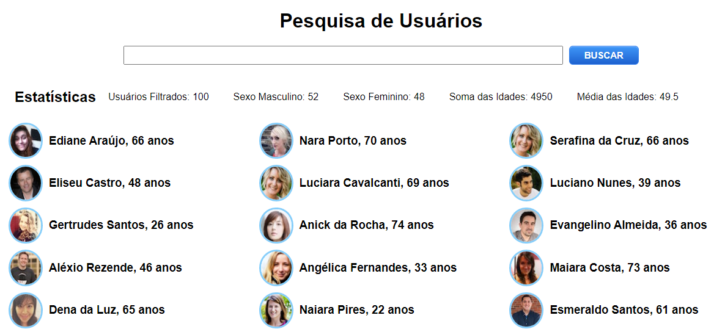

# BootcampIGTI-D1-User-Search-Filter

First practice challenge for the IGTI Fulstack Developer Bootcamp.

It fetches 100 'users' dummy data from a public API and lets you search the users by their name. 
It also summarizes some statistics about the filtered users.

A functional interactive version of the project can be found here: https://brunovaletta.github.io/BootcampIGTI-D1-User-Search-Filter/

